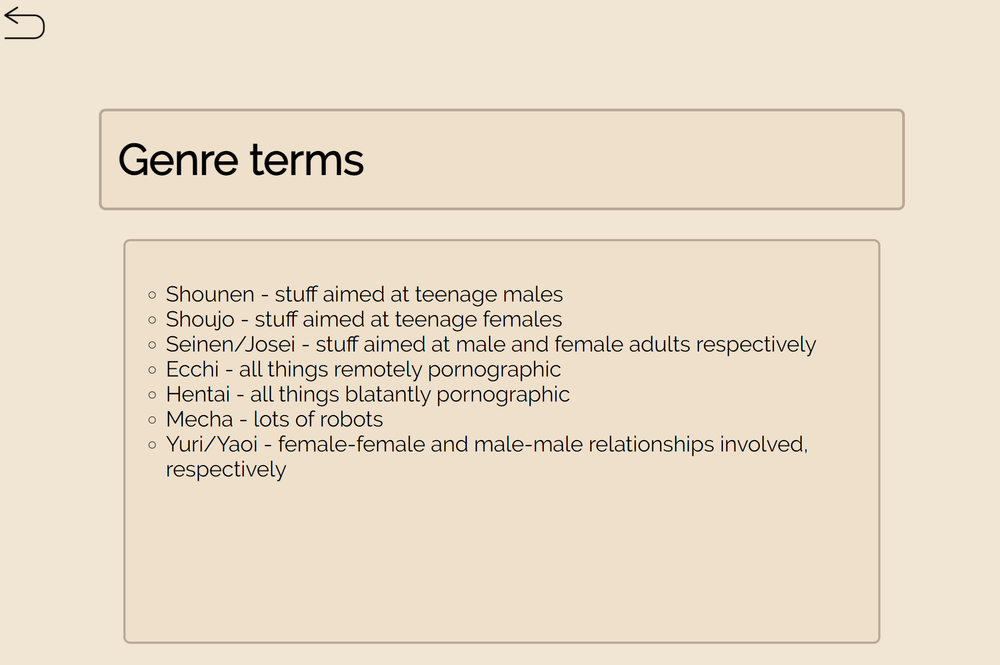
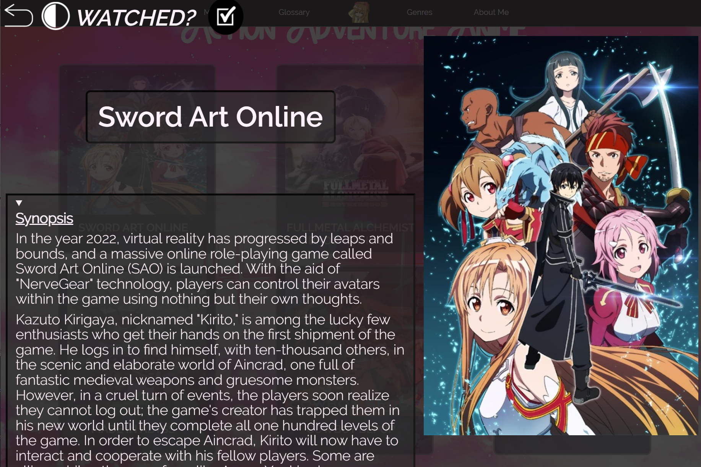

## Beginner's Anime Recommendation Catalogue

A simple *learning project* I embarked on when taking a fundamental web development course on coursera(html,css,javascript)(no react/jquery/bootstrap mumbojumbo). A fun attempt to create an anime "fandom/recommendation" website before I entered my university cs grind and learnt many good programming practices (for the .js) (though strictly speaking html/css isn't even programming but I won't go in that rabbit hole ><).

Access here: https://ang-zeyu.github.io/animeRecommendationCatalogue/

Also features a persistent progress bar using local storage so you know how far you've progressed 😏

